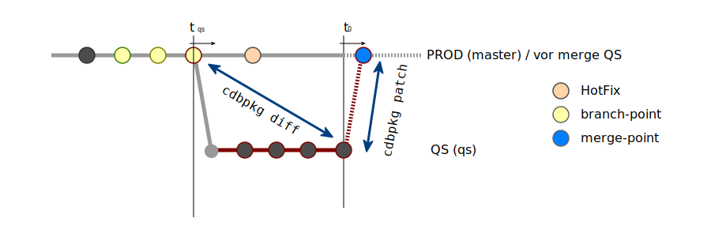

.. -*- coding: utf-8; mode: rst -*-
.. include:: ../refs.txt

.. |HotFix| image:: release_management/hotfix-point.svg
.. |branch-point| image:: release_management/branch-point.svg
.. |merge-point| image:: release_management/merge-point.svg

.. _release_management:

======================================
Releasemanagement und CONTACT Elements
======================================

.. sidebar:: Motivation

   Das Releasemanagement hat zur Aufgabe, sicherzustellen, dass eine erwartete
   Anforderung an eine Veränderung in einem Prozess mit einem vertretbaren Risiko
   in der geforderten Zeit erfolgreich umgesetzt werden kann. `[ref]
   <https://de.wikipedia.org/wiki/Releasemanagement>`__

.. contents:: Contents
   :depth: 2
   :local:
   :backlinks: entry

Ein geordnetes Releasemanagement ist reproduzierbar, trägt zu einer Verkürzung
der Durchlaufzeiten von Änderungen bei und mindert die Risiken in Projekten.
*Kurzum;* das Releasemanagement ist ein wichtiger Baustein der Projekt-Planung
und -Durchführung. Softwareentwicklung ist immer eine Team-Leistung bei der die
Team-Mitglieder ihre Änderungen aus verschiedensten Projekten in EINE
Infrastruktur einbringen. Diese Änderungs-Beiträge durchwandern i.d.R. noch
(Anwender-) Tests und *BugFixing* bevor sie schlussendlich in den Rollout
gehen. Aufgabe des Releasemanagement ist es, Entwicklungsprozesse über alle
Phasen des Projekts hin zu erfassen und einem geordnetem Verfahren zu
unterwerfen.

Das Releasemanagement kann nicht willkürlich ausgelegt werden, es wird
maßgeblich bestimmt durch die Verfahren, mit denen eine Änderung durch eine
Infrastruktur transportiert werden kann. Bei CONTACT Elements basiert der
Transport von Änderungen auf der Komponentenarchitektur (s.a. Foliensammlung
`CDB Komponenten & Entwicklung <../slides/cdb_comp/index.html>`__). Die
Komponentenarchitektur kennt eine Teilung **nur entlang der Pakete**. Damit ist
gemeint, dass ein Transport immer alle Änderungen eines **ganzen Pakets**
umfasst, die Pakete zueinander aber entkoppelt sind.

  Die parallele Entwicklung an unterschiedlichen Paketen ist durch
  die Komponentenarchitektur ausreichend entkoppelt.

Dieser Artikel befasst sich ausschließlich mit der Problematik die entsteht,
wenn mehrere Veränderungsprojekte in einem Paket parallel umgesetzt werden
müssen (was quasi für alle Kunden-Pakete der Fall ist).

.. _cs_elements_transport:

.. admonition:: Der Transport einer Änderung umfasst immer das ganze Paket.
   :class: tip

   Ein (Kunden-) Paket kann immer nur als ganze Einheit transportiert werden. Es
   ist nicht möglich zwei unterschiedliche Entwicklungen an einem Paket
   gleichzeitig aber doch für sich getrennt durch ein System (z.B. QS) zu
   transportieren.

Aus Sicht der Weiterentwicklung von Kundenanpassungen (``cust.plm``) wird hier
schon die erste maßgebliche Einschränkung des Releasemanagement deutlich: Im
Grunde können Weiterentwicklungen an einem (Kunden)-Paket nur *nacheinander*
entwickelt, getestet und ausgerollt werden.

In der Praxis wird man ein Releasemanagement finden müssen, dass einem unter den
gegebenen Rahmenbedingungen mehr Flexibilität bietet: Es muss immer mal wieder
ein HotFix angebracht werden und es muss ein Verfahren zur parallelen
Entwicklung geben. Auch wenn dieses Verfahren nicht über eine so schöne
Entkopplung wie die Pakete zueinander verfügt und deshalb auch etwas aufwendiger
sein wird als in getrennten Paketen parallel zu entwickeln.

Bei typischen CDB-Kunden existiert in der Kundenanpassung i.d.R. nur ein Paket
(``cust.plm``) und es wird dafür ein geordnetes Releasemanagement benötigt.  Die
hier im Artikel aufgezeichneten Entwicklungslinien aus Abbildungen wie :ref:`big
picture <figure-rm-big_picture>` zeigen immer die Entwicklungslinie **eines**
Pakets. An der Trennung der Pakete wird schon deutlich, dass auch die
Architektur der Kundenanpassung einen maßgeblichen Einfluss auf die
Projekt-Planung resp. das Releasemanagement haben kann.

.. _cs_elements_package_design:

.. admonition:: Exkursion: Design & Architektur der Kundenanpassung
   :class: note

   Auch eine Kundenanpassung kann in mehrere Pakete aufgeteilt werden. Die
   eigentliche Herausforderung dabei ist es, geeignete *Schnittlinien* zu
   finden, die der Projekt-Planung und dem Releasemanagement auch zukunftssicher
   mehr Freiheiten einräumen.  Bei den sich heute rasch ändernden Unternehmen
   sind *Schnittlinien* -- die auch in weiter Zukunft noch ihre Berechtigung
   haben -- im Vorfeld schwer festzulegen. Eine mögliche *Schnittlinie* könnte
   entlang der Sparten eines Unternehmens erfolgen, wenn man weiß, dass die
   Sparten mit unterschiedlichen Geschwindigkeiten Änderungsanforderungen an die
   *CONTACT Elements* Infrastruktur stellen werden. Es gibt dafür aber keine
   *allgemeingültige* Regel, weshalb wir hier nicht weiter auf dieses Thema
   eingehen wollen.

Die hier vorgestellten Verfahren zum Releasemanagement basieren auf einem
allgemein als `Feature Branch
<https://www.atlassian.com/git/tutorials/comparing-workflows/feature-branch-workflow>`__
bekanntem Workflow. Dieser wird auch im CDB Handbuch zur Komponentenarchitektur
vorgestellt.

.. _scm_caddok_base:

Die im CDB Handbuch zur Komponentenarchitektur vorgestellten Verfahren gehen von
*idealen* Bedingungen der *CONTACT Elements* Infrastruktur aus. Unter solch
*idealen* Bedingungen werden theoretisch alle Änderungen innerhalb eines Pakets
auch vom Paket erfasst. Für Softwarepakete von CONTACT oder Drittanbietern mag
das (inzwischen) auch stimmen. In der Praxis wird eine Weiterentwicklung an den
Kundenpaketen jedoch von Faktoren geprägt sein, die über den *Scope* des Pakets
hinaus gehen. Dazu gehören Objekte zum Testen, Objekte die ggf. noch nicht im
Kundenpakt aufgenommen wurden (z.B. Bugs wie *'Zuordnung zum Paket fehlt'* /
*'mangelhaftes DB-Schema'*) oder beispielsweise die Anbindung von
(Unternehmens-) Software an die Kundeninstanz, welche nicht von CDB-Komponenten
abgedeckt wird.

.. admonition:: komplette Instanz wird SCM-System versioniert
   :class: tip

   Es werden alle Dateien aus ``$CADDOK_BASE`` in die Versionsverwaltung mit
   aufgenommen. Das umschließt die komplette Installation des
   Applikation-Servers mit den Paketen in ``$CADDOK_BASE/site-packages`` und den
   Konfigurationen (z.B. aus ``$CADDOK_BASE/etc``). Nicht dazu gehören der
   BLOB-Store und temporäre Speicher wie z.B. ``./tmp`` und ``./app_conf``.

Eine CONTACT Elements Installation verfügt immer über Anpassungen:

- im Source Code und
- in der DB

.. admonition:: Sourcen und Konfiguration in der DB bilden eine Einheit.
   :class: tip

   Jede Änderung und sei es nur eine kleine Änderung an der Konfiguration muss
   dem Releasemanagement untergeordnet werden! Man sollte nicht einfach irgendwo
   in einem uralten System was konfigurieren und davon ausgehen, man könne diese
   Änderung *mal eben kurz ausrollen* und dabei das Releasemanagement umgehen.
   Jede Änderung steht potentiell im Konflikt mit anderen, parallelen
   Entwicklungslinien und muss eingeplant werden.

.. _db_export_at_branch_point:

Da wir nicht sicher sein können, dass alle Konfigurationen auch im ``cust.plm``
Paket enthalten sind (aus oben genannten Gründen) und weil wir auch die
Nutzdaten im Rahmen einer Entwicklung brauchen gilt für das hier vorgeschlagene
Releasemanagement zusätzlich noch:

.. admonition:: DB Export zu jedem Branch-Point
   :class: tip

   Sobald eine Entwicklung abzweigt (branch) wird ein Export der DB gesichert.
   Die Entwickler können sich dann ein Entwickler-System aus dem DB Export
   aufbauen (s.a. :ref:`init_cdb_mirror`).

Näheres zum DB-Export kann weiter unten im Abschnitt zum Anlegen des
Branch-Point nachgelesen werden. Hier noch ein paar umgangssprachliche
Nomenklaturen:

Rollout
  Markteinführung einer Änderung

PROD
  Im Betrieb befindliche CONTACT Elements Infrastruktur, Ziel aller
  Weiterentwicklungen.

QS
  CONTACT Elements Infrastruktur die für die Anwendertests der Änderungen bereit
  gestellt wird.

.. _rm_commit_def:

Commit
  Kleinste Einheit einer Änderung die im SCM-System versioniert werden kann auch
  *atomare* Änderung genannt und in den Abbildungen mit einem Kreis dargestellt
  (Hintergrundfarbe kann in den Abbildungen je nach Bedeutung des Commits
  variieren)

HotFix
  Eine Fehlerbehebung (i.d.R.) im PROD-System um den Betrieb erst mal aufrecht
  zu erhalten. Auch solche Änderungen müssen im Releasemanagement beachtet
  werden und werden im SCM-System versioniert. Jeder HotFix ist auch ein commit,
  in den Abbildungen mit einem Kreis dargestellt: |HotFix|

.. _rm_merge_def:

Merge
  Die Zusammenführung zwei oder mehrerer Entwicklungen, meist aber die
  Zusammenführung zweier Entwicklungslinien. Abgesehen von seltenen Ausnahmen
  (fast-forward) ist der Merge auch immer eine Änderung, ein commit im
  SCM-System der auch merge-point bezeichnet wird. In den Abbildungen mit einem
  Kreis dargestellt: |merge-point|

Branch: ``master``
  Haupt-Entwicklungslinie und i.d.R. auch gleichzeitig Stand des PROD

Branch: ``qs``
  Entwicklungslinie der QS

Branch-Point
  Abzweigung resp. Start-Punkt einer Entwicklungslinie. In den
  Abbildungen durch einen gelben Kreis |branch-point| gekennzeichnet.

.. _rm_system_branch_def:

System-Branch
  Entwicklungslinie einer Instanzen wie QS oder PROD. Zu diesen Branches gibt es
  **immer** eine aktive Instanz an der sich Anwender & Entwickler anmelden
  können. Beispiele hierfür sind die QS zum Testen und die PROD für den regulären
  Betrieb. Diese Instanzen verfügen über eine voll ausgebaute und *lauffähige*
  CONTACT Elements Infrastruktur inklusive der Kopplungen zu externen Systemen
  wie beispielsweise SAP oder Konvertierungs-Diensten.

.. _rm_feature_branch_dev:

Feature-Branch
  Entwicklungslinie eines Veränderungsprojekts. Wird z.T. auch als Dev-Branch
  bezeichnet.  I.d.R. sind die Instanzen zu solchen Branches nur für die
  Entwickler zugänglich.  Sie verfügen auch nur über einen, für die Änderung
  minimal erforderlichen Ausbau.  Fremdsysteme wie SAP werden beispielsweise nur
  dann angebunden, wenn dies für die Umsetzung des Feature erforderlich ist.
  Die Instanzen zu dem Feature-Branch existieren teilweise nur beim Lieferanten
  und nur für die Zeit der Entwicklung bis zum Rollout, danach können die
  Instanzen wieder verworfen werden.

Big Picture
===========

Bereits in der Einleitung wurde festgestellt, dass ein *sauberess*
Releasemanagement nicht willkürlich sein kann; es muss kausalen Ketten folgen
und unter den gegebenen Rahmenbedingungen (s.o. *Transport*) abbildbar
sein. Welche **Rahmenbedingungen** im Einzelnen zu beachten sind soll im
Weiterem erarbeitet werden. Als Gegenstand dient eine exemplarische
Infrastruktur mit:

- einer PROD Instanz für den *Betrieb* der Anwendung im Unternehmen und
- einer QS Instanz in der (Anwender-) Tests durchgeführt werden.

Eine solche Infrastruktur (:ref:`big picture <figure-rm-big_picture>`) ist
sicherlich die *kleinst-mögliche*, sie reicht aber aus um die Anforderungen und
Verfahren rund um das Releasemanagement zu erörtern.  In der Praxis wird man
oftmals eine etwas größere Infrastruktur, evtl. mit einem HotFix-System und
einer gemeinsamen Entwickler Umgebung (DEV) vorfinden und für Planung und Test
des Rollout wird man sich ggf. noch einen Spiegel des PROD Systems anlegen.
Ganz gleich wie aufwendig die Infrastruktur letztendlich ist, es wird eine
koordinierende Instanz benötigt; der **Maintainer**.

.. _job_of_maintainer:

.. admonition:: Der Maintainer koordiniert alle Änderungen (im SCM)
   :class: tip

   Die Koordination der Änderungen im Entwicklerteam, den Anwendertests und den
   Rollouts übernimmt der *Maintainer*. Der Maintainer verwaltet das zentrale
   Repository und vermittelt zw. den Projekt-Terminen und den dadurch
   erforderlichen Planungen in der Entwicklung & im Test.

Um die am System angebrachten Teil-Änderungen zu verwalten bedient man sich
eines Source-Code-Managment-Systems (SCM). Die parallelen Entwicklungen auf
Basis der CDB Komponentenarchitektur bedingen entsprechend viele parallele
Entwicklungslinien (a.k.a. Branches, s.a. `SCM-Branching`_). Damit empfiehlt es
sich git_ als SCM-System einzusetzen, da es über ein besonders leichtes,
schnelles und flexibles Branching-Model verfügt.

.. _recommend_git:

.. admonition:: Als SCM-System bietet sich git an
   :class: tip

   Andere SCM-System insbesondere zentrale SCM-Systeme wie SVN eignen sich
   weniger, da sie bei der Arbeit mit Branches zu schwach sind und kaum
   brauchbare Unterstützung bieten.  *Sollten Sie noch SVN verwenden, dann
   wechseln Sie JETZT zu* git_. Siehe auch Foliensammlung zur pragmatischen
   Einarbeitung: `get git started`_.

Die Abbildung :ref:`big picture <figure-rm-big_picture>` zeigt den zeitlichen
Verlauf dreier Änderungen in einer Infrastruktur mit PROD und QS.  Der gezeigte
verlauf ist **exemplarisch**. In den *eigenen* Projekten wird der Verlauf von
der Projekt-Leitung und dem :ref:`Maintainer <job_of_maintainer>` gemeinsam
geplant. Insbesondere wenn es zu Verzögerungen im Verlauf eines
Veränderungsprojekts kommt, besteht ein hoher Abstimmungsbedarf zw.
Projekt-Planung und Release-Planung. Dabei wird die Projekt-Planung dominiert
von den Faktoren *Resourcen* und *Terminen* und die Release-Planung muss
abschätzen in wie weit sie die Entwicklungslinien insbesondere der
:ref:`System-Branches <rm_system_branch_def>` unter den gegebenen
Rahmenbedingungen (s.o. *Transport*) möglichst ohne Verluste und mit
vertretbarem Aufwand der Projekt-Planung entsprechend anpassen kann.

Jeder kreisförmige Punkt in der Abbildung :ref:`big picture
<figure-rm-big_picture>` entspricht einer Teil-Änderung die im SCM-System
erfasst wird (:ref:`commit <rm_commit_def>`). Die Teil-Änderungen entlang einer
Entwicklungslinie wie z.B. ``foo`` beschreiben in ihrer Gesamtheit die
Implementierung eines Änderungsauftrags resp. des *Features*. Eine Linie von
Teil-Änderungen wird auch als **Patch-Serie** bezeichnet.

.. _figure-rm-big_picture:

.. figure:: release_management/big-picture.svg
   :alt:    Figure (big-picture.svg)
   :align:  center

   big picture (t\ :sub:`0`): Änderungsverlauf mit PROD & QS

Links von t\ :sub:`0` (*jetzt-Zeit*) ist die Historie und rechts der
Planungsverlauf zu sehen. In oberster Linie ist die Entwicklungslinie des im
Betrieb befindlichen PROD Systems zu sehen. Darunter die Entwicklungslinie des
QS-Systems.  Des Weiteren sind noch die Entwicklungslinien zweier
Weiterentwicklungen (:ref:`Feature-Branch <rm_feature_branch_dev>`) zu sehen,
die im Folgenden nur mit den Platzhaltern ``foo`` und ``bar`` unterschieden
werden sollen.  In der Projekt-Planung ist vorgesehen, die aktuellen Änderungen
aus dem QS noch in den Rollout zu bringen, danach soll der ``foo`` Branch in die
QS gemerged werden und dann ebenfalls in den Rollout gehen. Die Planung für den
Feature-Branch ``bar`` ist nur bis zum Merge in die QS dargestellt.  So
zumindest die Planung zum Zeitpunkt t\ :sub:`0`.  Der hier gezeigte Verlauf ist
exemplarisch; er soll u.A. erkennen lassen:

1. Die Abspaltung von Entwicklungslinien sollte immer vom *aktuellen* PROD
   (**master**) aus erfolgen.

.. _always_branch_from_master:

.. admonition:: Abspaltung immer von der Entwicklungslinie des PROD (**master**)
   :class: tip

   Ob und in welcher Form eine *aktuelle* Änderung z.B. aus dem QS-System
   überhaupt in Betrieb genommen wird, kann im Vorfeld nie mit absoluter
   Sicherheit gesagt werden. Deswegen empfiehlt es sich, jede Änderungen immer
   direkt vom *aktuellen* PROD ausgehend zu starten (s.a. :ref:`rm_create_branch`).

2. In der Praxis wird die Entwicklungslinie eines :ref:`System-Branch
   <rm_system_branch_def>` wie QS etwas anders ausgeprägt sein als die
   Entwicklungslinie eines :ref:`Feature-Branch <rm_feature_branch_dev>` wie
   ``foo``.

.. _always_update_sys_branch:

.. admonition:: System-Branches regelmäßig aus PROD aktualisieren
   :class: tip

   Abspaltungen für Systeme wie z.B. QS werden regelmäßig aus der PROD
   aktualisiert, z.B. nach Abschluss eines Rollouts. Um Konflikte beim Merge in
   die PROD zu reduzieren sollte die *Distanz* der aktuellen Zustände von PROD
   und anderen Branches, insbesondere der System-Branches so klein wie möglich
   gehalten werden.

Zusammenfassung der Entwicklungslinien aus der Abbildung :ref:`big picture
<figure-rm-big_picture>`:

``foo`` & ``bar``
  Zwei exemplarische Weiterentwicklungen die z.B. an einen Lieferanten
  beauftragt wurden oder aber im eigenen Haus abgewickelt werden. Beide
  Entwicklungslinien wurden, wie die QS vom PROD abgespalten (**branch**) und
  beide werden später wieder mit der PROD zusammengeführt (**merge**).

PROD
  Die letzte Änderung vor t\ :sub:`0` war ein *HotFix*. Planmäßig sollen als
  Nächstes (in der Reihenfolge) die letzten Änderungen aus QS, aus ``foo`` und aus
  ``bar`` in den Betrieb genommen werden.

QS
  Zum Zeitpunkt t\ :sub:`0` befindet sich eine Änderung in der QS, die in der
  Projektplanung als nächstes ausgerollt werden soll. Für den Rollout muss die
  QS mit dem PROD zusammengeführt werden (**merge**). Etwaige Konflikte aus den
  Änderungen aus dem HotFix mit den letzten Änderungen aus dem QS müssen
  aufgelöst werden.

.. _rm_merge_branch:

Zusammenführung zweier Entwicklungslinien
=========================================

Die Zusammenführung zwei Entwicklungslinien wird allgemein auch als **merge**
bezeichnet. Der Merge ist die eigentliche Herausforderung im Rahmen des
Releasemanagement. Ziel ist es, die Änderungen aus der einen Entwicklungslinie
mit denen aus einer anderen Entwicklungslinie zusammenzuführen. Im Folgendem
Beispiel sollen die vier Änderungen aus dem QS Branch in den PROD Branch
gemischt werden. Die Abbildung :ref:`qs-merge <figure-rm-qs-merge>` zeigt die
Entwicklungslinie des QS Branch bevor (obere Hälfte) und nachdem (untere Hälfte)
die Änderungen aus diesem Branch in den **master** (PROD) gemerged wurden.

.. _figure-rm-qs-merge:

.. figure:: release_management/merge-qs.svg
   :alt:    Figure (merge-qs.svg)
   :align:  center

   qs-merge: Zusammenführung der Änderungen aus QS mit PROD

Die Vorgehensweise beim Mergen ist immer gleich, egal ob man einen (Feature-)
Branch merged, oder wie hier eine Änderung aus dem QS übernehmen will. Die
Abbildung :ref:`merge-qs <figure-rm-qs-merge>` ist von daher, für sich alleine
erst mal nur abstrakt. Um das Beispiel etwas *konkreter* zu machen sei folgender
Kontext gegeben:

  Im PROD war ein Maskenfeld mit einem Auswahlbrowser konfiguriert. Dieser
  Auswahlbrowser lieferte aber falsche Werte. Damit die Anwender erst mal weiter
  arbeiten können wurde im PROD ein HotFix |HotFix| angebracht, mit dem die
  Editierbarkeit des Maskenfeld von *'nur aus dem Katalog zu befüllen'*
  (``catalog``) in *'frei editierbar'* (``free``) geändert wurde.  Anschließend
  hat man das Problem mit dem Auswahlbrowser (zeitnah) in der QS
  korrigiert. Dazu wurde keine neue QS aufgesetzt, sondern die bestehende
  genutzt, die wurde allerdings bereits abgespalten (branch) als der HotFix noch
  nicht im PROD war.

Das Beispiel mag etwas *konstruiert* anmuten, es beschreibt aber einen typischen
Fall (**conflict**), dem bei einem Merge besondere Beachtung geschenkt werden
muss. Schon aus der Beschreibung oben wird klar, dass im PROD und im QS parallel
und unabhängig voneinander an dem problematischen Maskenfeld (bzw.
Auswahlbrowser) Änderungen vorgenommen wurden: im PROD ist das Feld ``free`` und
im QS muss es -- mit dem korrigierten Auswahlbrowser -- auf ``catalog``
konfiguriert sein.  Werden die beiden Entwicklungslinien nun zusammengeführt, so
besteht ein *Konflikt* zw. dem HotFix |HotFix| und dem letztem Stand der QS
|merge-point|, der *nun* gemerged werden soll.

An welchem Commit der Konflikt mit der QS Entwicklungslinie auftritt brauchen
wir nicht zu wissen, wir sollten nur wissen, **dass es immer zu Konflikten
kommen kann, wenn zwei Entwicklungslinien zusammengeführt werden.** Konflikte
müssen erkannt und dann *fachlich* aufgelöst werden, so dass aus der Summe der
beiden Entwicklungslinien eine funktionierende und sinnvolle Anwendung entsteht.

.. admonition:: Konflikte müssen fachlich/inhaltlich aufgelöst werden, dafür
                gibt es keine Tools.
   :class: tip

   Vorausgesetzt die Entwicklungslinien sind kurz und bauen aufeinander auf, so
   sind die meisten Konflikte eher inhaltlicher/fachlicher Natur. Tools können
   helfen solche Konflikte zu erkennen, sie können aber keine fachlichen Fragen
   beantworten und sind somit auch nicht in der Lage die detektierten Konflikte
   selbständig aufzulösen.

.. _cs_elements_conflicts:

Bei Weiterentwicklungen auf Basis der CONTACT Elements gibt es zwei Arten von
potentiellen Konflikten:

- Konflikte im Quellcode: meist werden diese schon durch das SCM System (git)
  beim Merge erkannt. Der Merge Vorgang bleibt an der Stelle dann stehen und man
  muss ggf. manuell noch korrigierend eingreifen.

- Konflikte in der Konfiguration: Die Konfigurationen in der DB werden in JSON
  Dateien exportiert und im (Kunden-) Paket transportiert. Die JSON Dateien kann
  man nicht mit dem SCM mergen. Für die Zusammenführung zweier Konfigurationen
  gibt es die Tools ``cdbpkg diff`` und ``cdbpkg patch``. Nach dem ``cdbpkg
  patch`` kann man die Konflikte in CDB recherchieren und diese (fachlich) in
  CDB interaktiv auflösen.

Die Vorgehensweisen beim Merge werden im Abschnitt :ref:`rm_merge_cdbpg_patch`
detailliert beschrieben. Egal ob mit oder ohne Änderungen an der Konfiguration,
es gilt immer:

.. admonition:: Der Merge zweier Entwicklungslinien wird immer mit SCM-Commit
                abgeschlossen.
   :class: tip

   Beim Merge wird die **Patch-Serie** aus der einen Änderungslinie (QS) nahtlos
   an die andere Entwicklungslinie (PROD/master) angehängt. Alle einzelnen
   Commits aus QS sind jetzt Teil von PROD. Der merge-point |merge-point| ist
   auch ein Commit, er trägt u.A. die Änderungen in sich, die im Rahmen des
   Merge zur Konfliktauflösung vorgenommen wurden.

Im unteren Teil der Abbildung :ref:`figure-rm-qs-merge` ist bereits die PROD
Entwicklungslinie nach dem Merge dargestellt. Die Abb. :ref:`rm-bp-merged-qs`
zeigt das Eingangs gezeigte :ref:`big picture <figure-rm-big_picture>` nach dem
Merge.  In beiden Darstellungen ist zu sehen, dass sich die Commits, die vor dem
Merge nur in der QS-Linie waren, nun in der PROD-Linie wiederzufinden sind. Der
HotFix |HotFix| aus dem PROD verbleibt ebenfalls in der Historie, der
ggf. vorhandene Konflikt wurde ja im merge-point |merge-point| aufgelöst.

.. _rm-bp-merged-qs:

.. figure:: release_management/big-picture-merged-qs.svg
   :alt:    Figure (big-picture-merged-qs.svg)
   :align:  center

   big-picture (t\ :sub:`qs-merge`): Entwicklungslinien nach merge-qs

Schaut man auf die Abbildung, so kann man schon erahnen, wie ein Merge des
Foo-branches aussehen würde. Ebenso wie eben beim Merge des QS in die PROD würde
später (gestrichelte Linien) der ``foo`` Branch in die QS gemerged werden, wobei
die Patch-Serie der grünen Linie (``foo``) an das Ende der QS angehängt werden
würde.

.. _rm_merge_cdbpg_patch:

Merge mit git und cdbpkg Tools
==============================

Die Zusammenführung zweier Entwicklungslinien soll wieder am Beispiel
:ref:`qs-merge <figure-rm-qs-merge>` erfolgen, bei dem der QS-Branch in die
PROD-Linie gemerged wird (PROD ist das Ziel).

.. admonition:: Vor einem Merge oder Branch den letzten Änderungsstand comitten.
   :class: tip

   Bevor ein Merge durchgeführt oder einen Branch abspaltet wird, muss
   sichergestellt sein, dass der aktuelle Stand im SCM commited wurde.
   Insbesondere die Konfiguration aus der DB sollte dabei nicht vergessen
   werden, hierzu siehe :ref:`rm_dump_into_scm`.

Sobald der aktuelle Stand im SCM-System ist, kann mit dem eigentlichen Merge
angefangen werden. Ein Merge in CONTACT Elements besteht dabei immer aus zwei
Teilen (s.a. :ref:`potentielle Konflikte beim Merge <cs_elements_conflicts>`):

- Source Code: wird mit SCM (git) gemerged
- Konfiguration in der DB: wird mit ``cdbpkg diff & patch`` in CDB gemerged.

Die Konfiguration ist zwar in den JSON Dateien und somit im SCM-System
enthalten, für einen Merge mit dem SCM-System eignet sich das JSON Format aber
nicht.

.. admonition:: Vor einem Merge muss das Diff der CDB-Konfigurationen ermittelt
                werden.
   :class: tip

   Für die Zusammenführung zweier Konfigurationen erzeugt man mit ``cdbpkg
   diff`` einen Patch den man mit ``cdbpkg patch`` einspielen kann. Anschließend
   kann man die Änderungen in CDB recherchieren und ggf. vorhandene Konflikte
   auflösen.

Das Kommando ``cdbpkg diff`` erechnet die Differenz zwischen zwei Ständen der
Konfiguration eines Pakets. Um die Differenz des Kunden-Pakets (``cust.plm``) in
der Änderungslinie (QS) zu berechnen wird dazu der Ausgangspunkt, also
Branch-Point der QS Linie und der letzte Stand der Änderungslinie (QS)
benötigt, siehe Abb. :ref:`rm-cdbpkg-diff-qs`:

.. _rm-cdbpkg-diff-qs:

   merge: cdbpkg diff & cdbpkg patch

Der Ausgangspunkt des Feature-Branch ist der branch-point |branch-point| an dem
die Änderungslinie abzweigt. Den Commit der Abzweigung kann man mit folgendem
Kommando ermitteln::

  $ git log --oneline --decorate --graph --all
  ...
  | * 8e448cd (hello-world) hello-world: add changelog
  | * 0dd2abe add hello-world script
  * | c1ce07c add remark about 'hello world' order
  |/
  * 9af1a51 add README
  * 849c175 inital boilerplate

Obiges Log-Beispiel stammt aus der Foliensammlung `get git started`_, das
Repository dazu ist `github.com/return42/git-teaching
<https://github.com/return42/git-teaching/network>`__. Es soll hier ersatzweise
als ein Beispiel dienen um den Commit zu *finden*, an dem der branch-point
|branch-point| abzweigt. In dem Beispiel ist zu erkennen, dass der
``(hello-world)`` Branch bei Commit ``9af1a51`` abzweigt. Neben dem ``git log``
kann man aber auch andere Werkzeuge wie z.B. die `Git Extensions
<https://gitextensions.github.io/>`__ verwenden um die Historie zu visualisieren
(s.a. `git GUI Clients <https://git-scm.com/downloads/guis>`__).

Im Beispiel der Abb. :ref:`rm-cdbpkg-diff-qs` zweigt die QS Linie zum Zeitpunkt
t\ :sub:`qs` ab, hier im Beispiel nehmen wir mal an, dass der Commit zu diesem
Stand die ID ``4711`` trägt. Damit wir den Diff anfertigen können muss der Stand
zum Zeitpunkt t\ :sub:`qs` (also Commit ``4711``) nun in einen separaten Ordner
ausgecheckt werden. Hier im Beispiel verwenden wir ``/tmp/qs-branch-point``
(kann später wieder gelöscht werden).

.. code-block:: bash

   # !!! Auf dem Quell-System / im Feature-Branch (z.B. foo oder qs)  !!!
   # $ git checkout qs   # sollte i.d.R. bereits ausgechekt sein
   ...
   # git worktree add <workspace-folder> <branch-point>
   $ git worktree add /tmp/qs-branch-point 4711

Nachdem Feature-Branch ``qs`` und der Branch-Point ausgecheckt wurden, kann nun
mit ``cdbpkg diff`` die Differenz zwischen den beiden Konfigurationsständen des
``cust.plm`` Pakets berechnet werden.

.. code-block:: bash

   $ cdbpkg diff -p /tmp/qs-branch-point/cust.plm -d /tmp/merge-qs-patch cust.plm
   Writing changes to directory /tmp/merge-qs-patch
   ...

Der cdbpkg-Patch liegt nun im Ordner ``/tmp/merge-qs-patch``. Der Workingtree
``/tmp/qs-branch-point`` wird nicht mehr benötigt, er kann jetzt (oder auch
später) aus dem ``/tmp`` gelöscht werden. Mit ``prune`` löscht man ihn dann auch
aus dem lokalem git Repository:

.. code-block:: bash

   $ rm -r /tmp/qs-branch-point    # Worktree im Dateisystem löschen
   $ git worktree prune

Nachdem der cdbpkg-Patch vorbereitet ist, kann mit dem eigentlichen Merge
angefangen werden.  Als Erstes werden die Sourcen mit dem SCM-System gemerged.
Dazu wechselt man in den Branch, in dem man die Änderungen mergen
will. **Wichtig ist wieder, dass die cdbpkg Tools auf einen BLOB-Store und die
DB (des Ziel Systems) zugreifen können**.

.. admonition:: Die cdbpkg Tools müssen beim Merge Zugriff auf das Ziel System haben
   :class: tip

   Bei einem Merge z.B. von einem Feature-Branch in die QS wird man den Merge
   meist direkt im QS-System ausführen, da hier die Ausfallzeiten flexibler
   sind.  Die im Betrieb befindliche PROD bietet nur kurze Wartungsfenster für
   den Rollout, weshalb dieser dezidiert vorbereitet werden muss.  I.d.R. findet
   die Vorbereitung und der Test des Rollouts *zeitnah* in einem Spiegel-System
   der PROD statt. Die PROD darf dann bis zum Rollout gegenüber dem Spiegel
   keine Änderung an den Sourcen oder der Konfiguration erfahren.

Hier in den Beispielen *mergen* wir immer direkt in das Ziel System, in diesem
Beispiel also direkt in die PROD (``master``). Bereits oben wurde erwähnt: **Bei
einem Merge muss beachtet werden, dass nur der Source-Code nicht aber die ganze
Konfiguration in den JSON Dateien gemerged werden**. Der Merge beginnt deshalb
erst mal ganz normal:

.. code-block:: bash

   # !!! Auf dem Ziel-System / im Ziel-Branch (z.B. master) !!!
   # $ git checkout master  # sollte i.d.R. bereits ausgechekt sein
   ...
   $ git merge qs --no-commit --no-ff     # SCM merge
   Auto-merging cust.plm/cust/plm/module_metadata.json
   ...
   CONFLICT (content): Merge conflict in cust.plm/cust/plm/module_metadata.json
   Automatic merge failed; fix conflicts and then commit the result.

Ganz gleich ob man an dieser Stelle (wie hier im Beispiel) einen ``CONFLICT``
erhalten hat oder nicht, das ``merge`` Kommando eines SCM-System führt
i.d.R. immer alle Dateien im Workingtree zusammen. Es werden also auch immer die
JSON Dateien mit dem Kommando gemerged.  Hier im Beispiel gab es dabei einen
``CONFLICT``, das muss aber nicht unbedingt der Fall sein: manchmal *merged* das
SCM-Merge auch irgendwas zusammen, was es für *richtig* hält und dann meldet es
keinen Konflikt. Egal wie, **ein SCM-Merge ist nicht für die JSON Dateien**
geeignet und wir müssen diesen Teil wieder *zurück spulen* zu dem, was im
Ziel-Branch (hier der **master**) versioniert wurde.  Am einfachsten geht das im
Rahmen eines git-Merge mit ``checkout --ours``:

.. code-block:: bash

   $ cd cust.plm/cust/plm
   $ git reset configuration module_metadata.json
   $ git checkout --ours configuration module_metadata.json

Bei älteren CDB Versionen (10.x) müssen noch zwei weitere Objekte *zurück
gespult* werden:

.. code-block:: bash

   $ cd cust.plm/cust/plm
   $ git reset content_metadata.json patches           # ab CDB 15 nicht mehr erforderlich
   $ git checkout --ours content_metadata.json patches # ab CDB 15 nicht mehr erforderlich

.. admonition:: Konfiguration (JSON) darf nicht vom SCM-System gemerged werden.
   :class: tip

   Die Konfigurationen in den JSON Dateien werden nicht gemerged! Für den Merge
   der Konfiguration hat man sich mit ``cdbpkg diff`` einen Patch erzeugt, den
   man einspielen muss. Anschließend kann man die Änderungen in CDB
   recherchieren und ggf. vorhandene Konflikte auflösen..

Mit ``git status`` kann man nun überprüfen ob es auch Konflikte außerhalb der
JSON Dateien im Source-Code gab. Sollte in der Ausgabe noch ein *Unmerged paths*
auftauchen, so hat man noch nicht alle Konflikte im Source-Code aufgelöst.

.. code-block:: bash

   Unmerged paths:

       both modified:   cust/plm/foo.py

Wenn das der Fall ist, muss man diese Konflikte auflösen und die dabei
angebrachten Änderungen wieder mit ``git add`` in den *Stage* aufnehmen.
Nachdem alle Konflikte aufgelöst sind sollte in der ``git status`` Ausgabe ein
Satz wie *All conflicts fixed but you are still merging.* zu finden sein, hier
eine beispielhafte Ausgabe:

.. code-block:: bash

  On branch master
  All conflicts fixed but you are still merging.
    (use "git commit" to conclude merge)

  Changes to be committed:

          modified:   cust/plm/foo.py

Der merge der Dateien ist damit abgeschlossen und wir kommen zum zweiten Teil
des Merge, bei dem die Konfiguration gemerged wird.  Dazu spielt man den
cdbpkg-Patch ein und nach Prüfung in CDB wird nochmal ein ``build`` erzeugt.

Erst wenn alle Konflikte im Source-Code aufgelöst sind hat man wieder eine
*lauffähige* Instanz! In deren DB nun der zuvor erzeugte cdbpkg-Patch
``/tmp/merge-qs-patch`` eingespielt wird:

.. code-block:: bash

   $ cdbpkg patch /tmp/merge-qs-patch     # CDB-Merge

.. admonition:: Service-Daemon im Update-Modus
   :class: tip

   Falls erforderlich kann der Service-Daemon so gestartet werden, dass keine
   Konsistenzprüfung der Paketinstallation durchgeführt wird
   :ref:`[ref] <cdbsvcd_for_update>`::

     cdbsvcd --debug --for_update

Nun kann man in CDB die Änderungen recherchieren und etwaige Konflikte auflösen
(Dazu einen build erstellen, alternativ Dev-Build in CDB).

.. code-block:: bash

   $ cdbpkg build cust.plm

Der Merge ist abgeschlossen, sobald man der Überzeugung ist, dass alle
Änderungen aus dem Branch korrekt übernommen wurden. Man hat dann Änderungen im
Dateisystem und an der Konfiguration in der DB, die beide noch nicht ins SCM
Commited wurden (der Merge ins SCM ist noch nicht abgeschlossen). Um den Merge
abzuschließen und ins SCM-System aufzunehmen, muss man wieder einen *build*
erzeugen und dann alles im SCM-System als auch in CDB (app_conf) *committen*:

.. code-block:: bash

   $ cdbpkg build cust.plm
   ...
   $ git add --all cust.plm/cust/plm
   $ git commit -m "merged branch 'qs'"
   $ cdbpkg commit cust.plm

Die Änderungen sind (der Merge ist) jetzt im lokalem Klone des Repository. Er
muss *irgendwann* dann auch mal an den SCM-Server gepusht werden. Bei einem
Feature-Branch oder der QS wird man den Push vermutlich gleich durchführen. Bei
der PROD (**master**) gehört dieser Push allerdings zum Rollout und sollte
deshalb ggf. für später -- am besten kurz vor dem Rollout Termin -- eingeplant
werden.

.. _rm_create_branch:

Branch-Point
============

Die Aufgabe des Branch-Point ist es, einen klar definierten Zustand festzuhalten
(s.a. `Branches-in-a-Nutshell
<https://git-scm.com/book/en/v2/Git-Branching-Branches-in-a-Nutshell>`__) auf
dem eine Änderungslinie aufbaut.  Dieser *gesicherte* Zustand wird später beim
Merge von CDB benötigt um die Differenz zwischen zwei Konfigurationsständen
(JSON) eines Pakets zu berechnen (vgl. :ref:`rm-cdbpkg-diff-qs`). Die Abbildung
:ref:`branch point <figure-rm-branch-foo>` zeigt die Entwicklungslinie eines
exemplarischen Feature-Branch ``foo`` in einer Infrastruktur mit PROD und QS.

.. _figure-rm-branch-foo:

.. figure:: release_management/branch-foo.svg
   :alt:    Figure (branch-foo.svg)
   :align:  center

   branch-point: Abzweigung für einen Feature-Branch

Inital beginnt der foo-Branch am Branch-Point zum Zeitpunkt t\ :sub:`foo`.  Die
Abspaltung von Entwicklungslinien sollte immer vom *aktuellen* PROD **master**
aus erfolgen. Dort fangen alle Entwicklungen an, dort müssen sie am Ende auch
wieder hin: :ref:`Abspaltung immer von der Entwicklungslinie des PROD
<always_branch_from_master>`. Ebenfalls in Abbildung :ref:`branch point
<figure-rm-branch-foo>` zu sehen ist, dass ein :ref:`System-Branch
<rm_system_branch_def>` wie QS regelmäßig aus der PROD aktualisiert wird:
:ref:`System-Branches regelmäßig aus PROD aktualisieren
<always_update_sys_branch>`.

Die Aktualisierung eines Feature-Branch aus der PROD sollte nach Möglichkeit nur
selten erforderlich sein, ist aber im Bedarfsfall grundsätzlich möglich. Eine
Aktualisierung des Feature-Branch ``foo`` ist z.B. dann erforderlich, wenn man
im Verlauf des Projekts feststellt, dass eine andere Änderung, die erst nach der
Abspaltung von ``foo`` implementiert wurde (z.B. die Änderungen aus der QS) nun
doch in ``foo`` benötigt wird. In diesen Fällen muss man sich die benötigte
Änderung (Patch-Serie) in den ``foo`` Branch *holen*, was einem :ref:`Merge
<rm_merge_cdbpg_patch>` entspricht, bei dem **'foo' das Ziel ist**. Alternativ
kann man aber auch einen sogenannten **Rebase** durchführen, sofern der Feature
noch nicht schon von anderer Stelle aus geclonet wurde (s.a. `Merging
vs. Rebasing <https://www.atlassian.com/git/tutorials/merging-vs-rebasing>`__ &
`The Golden Rule of Rebasing
<https://www.atlassian.com/git/tutorials/merging-vs-rebasing#the-golden-rule-of-rebasing>`__).

Ein anders Beispiel ist der Fall, bei dem man ``foo`` ins QS gemerged hat und
beim Testen dann weitere Änderungen angebracht hat die man nicht verlieren will,
man aber gleichzeitig feststellt, dass es noch weiterer und ausführlicher
Nacharbeiten bedarf, die nicht mehr im QS -- sondern wieder *zurück* -- im
``foo`` Branch umgesetzt werden müssen, weil *jetzt* erst mal eine andere
Änderung durch die QS *gezogen* werden soll.

.. admonition:: Vorausschauende Planung hält den Aufwand für Merges klein.
   :class: tip

   Egal was die Gründe sind, ein Merge ist immer mit einem gewissen Aufwand
   verbunden, der um so größer wird, um so weiter sich zwei Entwicklungslinien
   voneinander entfernen.  Insbesondere *Langläufer* die sich unnötig früh von
   der PROD abspalten sollten schon in der Projekt-/Release-Planung vermieden
   werden. Dennoch muss man aber immer flexibel reagieren können: Ein Plan ist
   ein Plan und man weiß nie, wann im Projektverlauf einem die Risiken
   schlussendlich *um die Ohren fliegen*.

Branch mit git anlegen
======================

Für das Anlegen eines Branch-Points braucht man kein CDB-Tool und keinen
CDB-Dienst.  Ein Branch-Point lässt sich sehr einfach auf einem Klone des git
Repository anlegen, den man sich beispielsweise auf seinem Desktop PC erzeugt
hat.  Dennoch sollte sichergestellt sein, dass sich auch *letzte* Änderungen
bereits im SCM-System befinden. Insbesondere die Konfiguration aus der DB sollte
dabei nicht vergessen werden, hierzu siehe :ref:`rm_dump_into_scm`. Ist das
erledigt kann der Branch-Point ohne CDB angelegt werden. Hier im Beispiel soll
der Branch-Point vom letzten Commit des PROD (**master**) ausgehen:

.. code-block:: bash

   $ git clone http://gitserver/cust_plm # falls nicht eh schon vorhanden
   $ git checkout -b master              # falls nicht bereits ausgecheckt
   $ git pull                            # falls nicht eh schon aktuell

Mit Letzterem hat man den aktuellen Stand des **masters** ausgecheckt (was
i.d.R. auf dem PROD-Server ohnehin immer der Fall sein sollte).  Der
Branch-Point kann nun auf dem aktuellen Stand des **master** angelegt werden,
das geschieht immer erst mal lokal und dann schiebt man diesen Branch-Point auf
den git-Server:

.. code-block:: bash

   $ git branch <branch-name>         # Branch lokal anlegen aber nicht aus-checken
   $ git push -u origin <branch-name> # Branch auf dem zentralem Server bereitstellen

Vergleicht man die bisherige Vorgehensweise mit dem im CDB Handbuch zur
Komponentenarchitektur vorgestelltem Verfahren, so wird man merken, dass die
Verfahren dort, an diesem Punkt enden und nicht über das (Kunde-) Paket hinaus
gehen.  In der Praxis wird man aber bei der Weiterentwicklung auf Nutzdaten
angewiesen sein, die nicht im Paket enthalten sind und für die man sich nun ein
Transport-Mechanismus ausdenken müsste.

Diesen und anderen Problemen (s.o. :ref:`Scope des Pakets <scm_caddok_base>`)
geht man am einfachsten aus dem Weg, indem man zu jedem Branch-Point einen
Export der DB erstellt.

.. admonition:: DB Export zu jedem Branch-Point
   :class: tip

   Das Spiegelsystem für die Entwicklung der geplanten Änderung wird aus dem DB
   Export aufgebaut (s.a. :ref:`init_cdb_mirror`).

Der DB Export wird im jeweiligen Management Tool des DB-Systems erstellt.  Für
die Ablage eignet sich ein Share auf den die Entwickler zugreifen können um sich
Spiegel-Systeme aufbauen zu können. Evtl. reicht aber auch schon die
tagesaktuelle Sicherung des DB-Managment für einen Import im Spiegel-System
aus. Egal wie man es macht, man sollte sich den Export zum Branch-Point solange
aufheben, bis die Änderung im PROD gemerged wurde (die Änderung also in Betrieb
genommen wurde). Hilfreich können Namen oder Listen sein, die das Datum des
Exports und den Namen des Branch-Points erkennen lassen, wie z.B.::

  PROD-EXP-<YYYYMMDD-HH:MM>-<branch-name>.

.. _rm_dump_into_scm:

Dump der Konfiguration ins SCM
==============================

Bevor man einen Branch-Point anlegt oder einen Merge durchführt, muss der
aktuelle Stand der Konfiguration -- der sich u.U. nur in der DB befindet -- in
die JSON Dateien exportiert und in das SCM-System commited werden. Hierfür
empfiehlt es sich prophylaktisch einen ``build`` zu erzeugen. Im dem folgendem
Beispiel soll ein Dump der Konfigurationen des PROD Systems (**master**)
erfolgen, also wird der ``build`` auch dort im PROD-System ausgeführt.  Der Dump
von QS oder einem Feature-Branch wäre analog, nur eben im jeweiligen System:

.. code-block:: bash

   # !!! Auf dem jeweiligen System, hier z.B. dem master (PROD)      !!!
   # !!! sollte der richtige Branch eigentlich schon ausgechekt sein !!!
   $ git checkout master

Wichtig ist, dass die cdbpkg Tools auf einen BLOB-Store und die DB zugreifen
können, hier im Beispiel ist das der Applikation Server der PROD.

.. code-block:: bash

   $ cdbpkg build cust.plm               # DB export

Sollte ein ``git status`` eine Differenz anzeigen, so muss der *aktuelle* Stand
noch in das SCM-System commited werden:

.. code-block:: bash

   $ git add --all .                     # SCM-Commit ..
   $ git commit -m "retain last changes from PROD"
   $ cdbpkg commit cust.plm              # CDB-Commit
   $ git push                            # auf SCM-Server ablegen

Die hier in den Beispielen verwendeten Commit-Messages sind exemplarisch und für
die Praxis ungeeignet, hierzu siehe Abschnitt :ref:`recommend_commit_msg`.

.. _recommend_commit_msg:

Commit-Messages
===============

In der Praxis wird den Commit-Messages in viel zu vielen Projekten und leider
auch von vielen Zulieferern noch zu wenig Beachtung geschenkt, dabei sind die
Commit-Messages insbesondere bei langlebigen Projekten und wechselnden
Projektteams von besonderem Wert.

Saubere Commit-Messages sind erste Voraussetzung für eine Recherche.  Eine
Commit-Message gibt Auskunft darüber, was eine Änderung bezwecken soll und was
die Motivation zu dieser Änderung war. Die Historie eines Änderungsverlaufs wird
durch die Summe der Commit-Messages beschrieben. In dieser Historie will man
sich als Entwickler bewegen und einen Änderungsverlauf verstehen, ohne dass man
dazu die einzelnen Teil-Änderungen im Detail anschaut. Es muss im Verlauf der
Historie zumindest grob erkennbar werden, *was, wann, wo und warum* geändert
wurde.

Wie wichtig *gut gewählte* Commit Messages sind wird z.B. deutlich wenn es um
die Auflösung von Konflikten geht. Dabei (beim Merge) muss man wissen, warum
*diese Änderung hier im Branch* anders ausgefallen ist als *die gleiche Änderung
im anderen Branch*. Ohne die inhaltlichen, fachlichen und ggf. auch technischen
Hintergründe einer Änderung muss derjenige, der den Merge durchführt selber
**erahnen** was die Gründe dafür waren und wie man den Konflikt am besten
auflöst .. etwas zu **erahnen** ist keine solide Basis für eine Entscheidung.

.. admonition:: Die Commit-Message sollte *einheitlich* und *ausdrucksstark*
                sein.
   :class: tip

   In der Praxis hat sich ein einfaches Schema bewährt::

      <tag>: <Zusammenfassung>

      Lorem ipsum dolor sit amet, consetetur sadipscing elitr, sed diam nonumy
      eirmod tempor invidunt ut labore et dolore magna aliquyam erat, sed diam
      voluptua.

Es hat sich bewährt die ersten Zeile am Anfang mit einem ``<tag>`` mit
anschließendem Doppelpunkt zu beginnen. Das ``<tag>`` sollte einen Hinweis auf
den Kontext geben, zu dem diese Änderung gehört. Der Kontext kann sein:

- Eine Fehler- oder Vorfallnummer wie z.B.: ``I004711:`` für *issue 4711*

- Die Kurzbezeichnung des Projekts, z.B. ``FooFoo:`` für alle Commits
  (Beiträge), die das FooFoo-Feature implementieren und/oder korrigieren.

- Eine Sparte oder eine Modulzuordnung, wie z.B. ``doc:`` für Korrekturen an der
  Dokumentation

- Manchmal kann der Kontext aber auch ganz allgemeiner Natur sein wie
  z.B. ``HotFix:``

Die erste Zeile sollte ein kompakter *one-liner* mit Kontext und Zusammenfassung
sein, der aber auch nicht mehr als 80 oder 120 Zeichen haben sollte.  Darauf
folgt eine Leerzeile und danach kann ein ausführlicherer Text kommen der die
Hintergründe dieser Änderung beschreibt. Dabei beschreibt man nicht den
Source-Code, sondern das, was die Änderung bezwecken soll.  Für das Beispiel von
oben, bei dem ein HotFix angebracht wurde, könnte man beispielsweise schreiben:

.. code-block:: none

  HotFix: Maskenfeld XYZ auf 'free' gesetzt

  Das Maskenfeld XYZ war mit einem defekten Auswahlbrowser XYZ konfiguriert,
  welcher falsche Werte lieferte. Damit die Anwender erst mal weiter arbeiten
  können wird dieser HotFix angebracht, mit dem die Editierbarkeit des
  Maskenfelds von 'catalog' (nur aus dem Katalog zu befüllen) in 'free' (frei
  editierbar) geändert wird.

  Eine Überarbeitung des Auswahlbrowser XYZ findet derzeit schon im QS statt und
  soll später diesen HotFix ersetzen.

Wenn man später (:ref:`so wie oben gezeigt <rm_merge_branch>`) dann die
Überarbeitung aus dem QS in die PROD merged, dann weiß man aufgrund der
ausführlichen Commit-Message genau, wie man mit dem Konflikt rund um das
Maskenfeld XYZ umzugehen hat.

Ohne eine derartige Commit-Message und ohne die Hinweise auf *HotFix* &
*Überarbeitung im QS* wüsste man beim Merge nicht mehr warum die Änderung damals
angebracht hatte. Hier noch das negativ-Beispiel dazu:

.. code-block:: none

  BugFix: Maskenfeld XYZ auf 'free' gesetzt

  Das Maskenfeld XYZ sollte auf 'free' gesetzt werden; ist hiermit
  erledigt.

Letztere Commit-Message hat für andere Personen als den Ersteller kaum einen
Informationsgehalt. Es fehlt der Hinweis darauf, dass es sich eigentlich nur um
einen HotFix handelt, das eigentlich der Auswahlbrowser kaputt ist und das
dieser noch überarbeitet wird und das diese Überarbeitung diesen HotFix dann
ersetzen wird. Wie soll ein Maintainer der den Merge dazu durchführen will mit
dem Kontext aber evtl. nicht vertraut ist, wie soll der wissen welche
Entscheidungen er bei der Konfliktauflösung treffen soll. Ohne stundenlange
Recherchen und Nachfragen ist es bei derart schlechten Commit-Messages oftmals
kaum möglich vernünftige Entscheidungen treffen.

.. admonition:: Schlechte Commit-Messages kosten Geld
   :class: tip

   Hört endlich auf damit und schreibt Eure Commit Message aus der Perspektive
   des Maintainers, der Euer Projekt nicht im Detail kennen kann!!!!

Common Pitfalls
===============

Ein paar Hinweise zu *gern* gemachten Fehlern:

**Branch im laufendem Prozess wechseln**
  Man darf auf einem System, auf dem CDB Prozesse laufen nicht einfach den
  Workingtree ändern, indem man z.B. ein **checkout** eines anderen Branches
  macht. Zum Einen mögen es die gerade aktiven Prozesse nicht, wenn man ihnen
  den Workingtree *unter dem Arsch* wegreißt und zum Anderen hat jeder Branch
  seine eigene DB .. im schlimmsten Fall wird dann noch gegen die falsche DB
  Verbunden und diese dann sabotiert!
