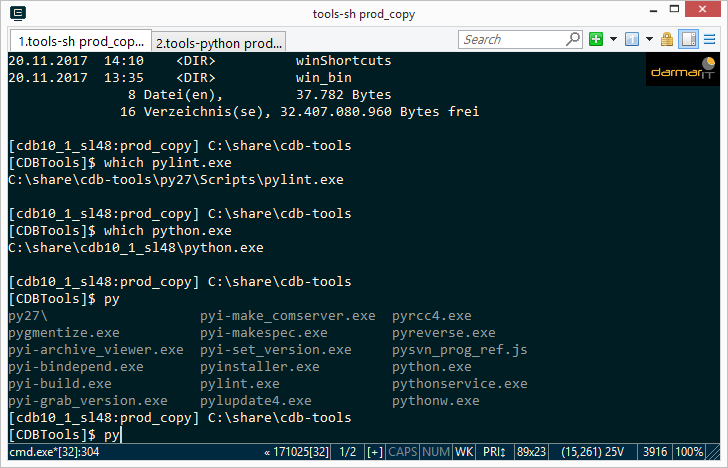

.. -*- coding: utf-8; mode: rst -*-
.. include:: ../refs.txt

.. _cdbtools_console:
.. _cdbtools_ConEmu:

================
Konsole & ConEmu
================

Features wie *tab-complition* oder *auto-doc*, wie man sie z.B. aus dem
PowerScript Studio kennt hat man bisher auf der Konsole vermisst. Die CDB-Tools
bringen Pakete wie ptpython_ mit, die solche Features auch in einer Py-Konsole
bereit stellen.  Diese sind auf Linux & Unix Konsolen direkt nutzbar, darüber
hinaus haben Linux Konsolen schon immer *tab-completion* für die Shell.

Während es auf Linux & Unix komfortable Konsolen gibt, gibt es auf Windows
lediglich die ``cmd.exe`` und deren Konsole ist wohl eher eine Behinderung den
eine Unterstützung bei der Arbeit .. um nicht zu sagen: sie ist echter Grumpf
verglichen mit dem was man aus der Linx & Unix Welt kennt.  Die CDB-Tools
schließen diese Lücke nun auch in der Windows Welt, indem sie den
Konsolen-Emulator `ConEmu`_ mit der clink_ Erweiterung bereit stellen.

Mit dem Konsolenemulator ConEmu hat man dann auch unter Windows die Möglichkeit
Features wie *tab-complition* oder *auto-doc* in der Konsole abzubilden und
Interaktive Konsolen wie ptpython_ können ihre volle Leistungsfähigkeit
entfallten.

   Beispiel für eine Windows Shell in dem ConEmu

.. figure:: console/CunEmu-python-completion.png

   Beispiel für einen Python oder PowerScript Interpreter mit ptpython_ in dem
   ConEmu.
