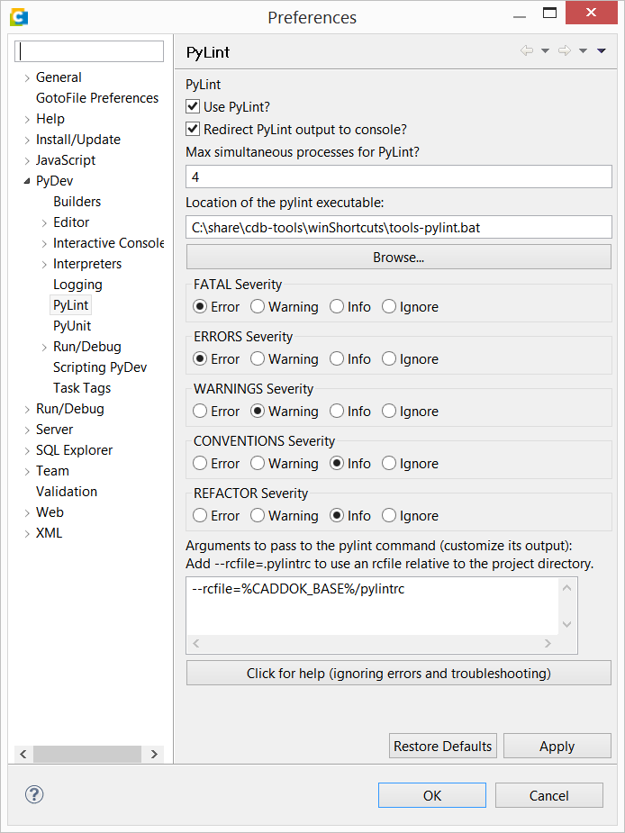

.. -*- coding: utf-8; mode: rst -*-

.. include:: ../refs.txt

.. _cdbtools_eclipse:
.. _powerscript_studio:

============================
Eclipse & PowerScript Studio
============================

Das PowerScript Studio ist eine Eclipse_ Installation mit vorinstalliertem
Plugins wie PyDev_ und einem Dropin von Contact, in dem der Projekt-Wizzard für
CDB Installationen enthalten ist (siehe ``$CADDOK_BASE\eclipse\dropins``).
Alternativ zum PowerScript Studio kann auch eine aktuelle Eclipse Version mit
PyDev genutzt werden, in der das Dropin installiert wird, worauf aber hier nicht
weiter eingegangen werden soll.

get started
===========

Das Basis-Setup des Eclipse wird beim ersten Start im HOME-Ordner abgelegt
(``.eclipse`` Ordner).  Ebenfalls beim ersten Start wird man gefragt, wo man
seinen Arbeitsbereich anlegen möchte.

.. figure:: eclipse/WorkspaceLauncher.png
   :scale: 50%

   Eclipse Workspace Launcher

.. tip::

   Will man seine Eclipse Settings komplett entfernen, so muss man den Ordner
   ``$HOME/.eclipse`` und den Ordner für den Arbeitsbereich
   (z.B. ``$HOME/workspace``) löschen.

In diesem Arbeitsbereich speichert Eclipse die Metadaten zu den Projekten, die
man in Eclipse einrichtet, da sht dan z.B. auch drin, wo man seinen
Arbeitsbereich angelegt hat Ist der Arbeitsbereich gesetzt, so startet Eclipse
und man kann sein PowerScript Studio Projekt anlegen (Kontextmenü im
Project-Explorer).

.. figure:: eclipse/cdb_instance.png
   :scale: 50%

   PowerScript Studio Projekt anlegen

.. tip::

   Neue Entwickler-Pakete leg man am einfachsten mit ``cdbpkg new`` an
   :ref:`[ref] <cdbpkg-new>`.

PyLint einrichten
=================

Das PyDev_ hat einen integrierten Code-Checker, wesentlich ausgereifter und
flexibler ist aber Pylint_, das sich inzwischen zum *Standard* etabliert hat.
Alle Code-Checker auf dem *freien Markt* kennen i.d.R. die CDB-Runtime, das
Vererbungsmodell in CDB und den ORM von CDB nicht, weshalb ihr Einsatz immer nur
mit Auflagen möglich ist.  Dennoch kann man sagen, dass bei einem umsichtigen
Einsatz dieser Werkzeuge die Code-Qualität und die Produktivität signifikant
verbessert werden kann.

Die CDB-Tools bringen eine Pylint Installation und ein Pylint Profil mit, dass
in Eclipse eingerichtet werden kann.  Dazu öffnet man in Eclipse die
Einstellungen unter :menuselection:`Window / Preferences`.

   PyDev Preferences (Pylint)

Unter :menuselection:`PyDev / Pylint` muss das Häkchen bei :guilabel:`Use
Pylint` gesetzt werden.  Als Launcher trägt man ``cdbtools-activate`` ein und
unten in den Argumenten ruft man dann das eigentliche ``pylint`` Kommando auf,
dem man noch ein Profil mitgeben kann, hier im Beispiel wird das Profil aus den
Vorlagen der CDB-Tools genutzt.

Das reicht aber nicht, im jeweiligen PyDev Projekt muss man noch die Sourcen
einstellen, wenn man möcht, kann man unter den :guilabel:`External Libraries`
noch die Python Pfade aus den CDB-Tools eintragen (muss man aber nicht).

   PyDev Sourcen des Projekts

   PyDev Sourcen des Projekts

Hat man alles eingestellt, so wird bei jedem Speichern einer geänderten Python
Datei nun ein Check mit dem Pylint durchgeführt.  Auf der linken Seite, sieht
man Symbole für die Meldungen aus dem Pylint-Lauf.  Rechts im Übersichtsbalken
sind entsprechend farblich hervorgehobene Bereiche.

.. figure:: eclipse/Pylint_example001.png
   :scale: 50%

   Pylint Meldungen in Eclipse.

